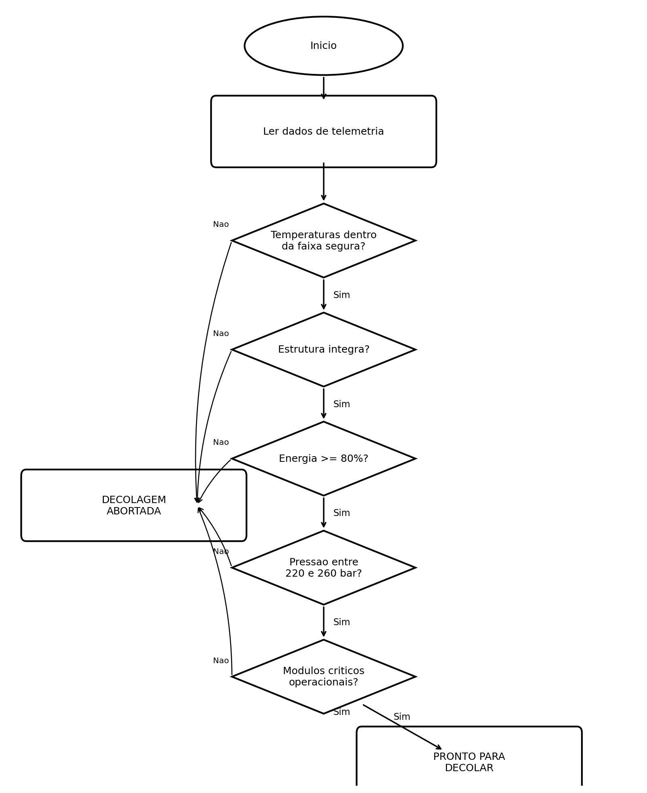
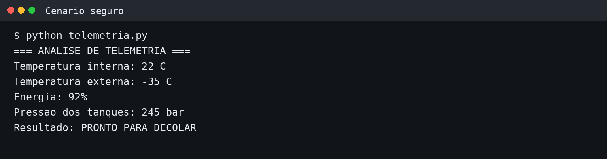
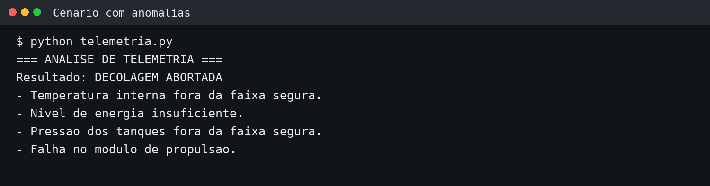
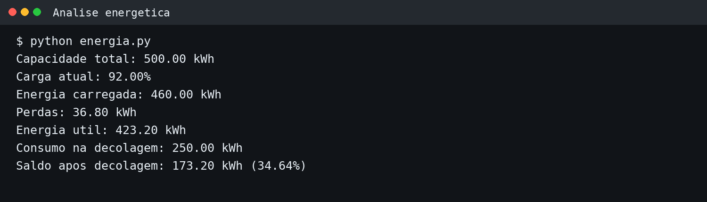

# Sistema de Telemetria Espacial

Projeto acadêmico desenvolvido para uma Atividade Integradora de Ciência da Computação. O objetivo é simular a leitura de telemetria de uma nave e aplicar regras de segurança para decidir entre **PRONTO PARA DECOLAR** e **DECOLAGEM ABORTADA**.

> **Observação:** os limites utilizados neste projeto são parâmetros didáticos definidos exclusivamente para a simulação e não correspondem a especificações de uma nave real.

## Funcionalidades

- Leitura simulada de temperatura interna e externa;
- Verificação de integridade estrutural;
- Análise do nível de energia;
- Verificação da pressão dos tanques;
- Checagem dos módulos de navegação, comunicação e propulsão;
- Detecção e descrição de anomalias;
- Cálculo de energia útil e saldo energético após a decolagem;
- Comparação entre um cenário seguro e um cenário com falhas.

## Estrutura do repositório

```text
telemetria-espacial/
├── README.md
├── telemetria_espacial.ipynb
├── imagens/
│   ├── execucao_pronto.png
│   ├── execucao_abortada.png
│   ├── execucao_energia.png
│   └── fluxograma.png
└── relatorio/
    └── relatorio_telemetria.pdf
```

## Regras de segurança da simulação

| Parâmetro | Faixa/condição segura |
|---|---|
| Temperatura interna | 18 °C a 27 °C |
| Temperatura externa | -60 °C a 40 °C |
| Integridade estrutural | 1 = íntegra |
| Energia | mínimo de 80% |
| Pressão dos tanques | 220 a 260 bar |
| Navegação | 1 = operacional |
| Comunicação | 1 = operacional |
| Propulsão | 1 = operacional |

## Fluxograma



## Exemplos de execução

### Cenário seguro



### Cenário com anomalias



### Análise energética



## Como executar

1. Instale o Python 3.10 ou superior.
2. Instale e abra o Jupyter Notebook/JupyterLab, ou envie o arquivo para o Google Colab.
3. Abra `telemetria_espacial.ipynb`.
4. Execute as células em ordem, usando **Run All**.
5. Observe os resultados impressos para os dois cenários e para a análise energética.

O código principal utiliza apenas recursos nativos do Python. Para abrir o notebook localmente, é necessário ter um ambiente Jupyter instalado.

## Análise energética

A simulação considera:

- Capacidade total: **500 kWh**;
- Carga atual: **92%**;
- Energia carregada: **460 kWh**;
- Perdas: **8% = 36,8 kWh**;
- Energia útil: **423,2 kWh**;
- Consumo estimado na decolagem: **250 kWh**;
- Saldo após a decolagem: **173,2 kWh**, equivalente a **34,64%** da capacidade total.

Sem uma taxa de consumo por hora para a fase posterior à decolagem, o projeto não converte esse saldo em horas de autonomia. Isso evita supor um valor que não foi fornecido no enunciado.

## Análise assistida por IA

Prompt utilizado:

> Classifique os dados de telemetria apresentados, identifique anomalias e descreva os principais riscos para a decolagem. Considere como anomalia qualquer valor fora das faixas de segurança definidas no projeto.

A análise do cenário seguro indicou baixo risco. No cenário de teste, foram identificadas temperatura interna elevada, energia insuficiente, pressão dos tanques acima do limite e falha no módulo de propulsão, resultando em **DECOLAGEM ABORTADA**.

## Autoria

**Maria Luiza Coelho Inocêncio**  
Ciência da Computação - FIAP  
São Paulo - 2026
